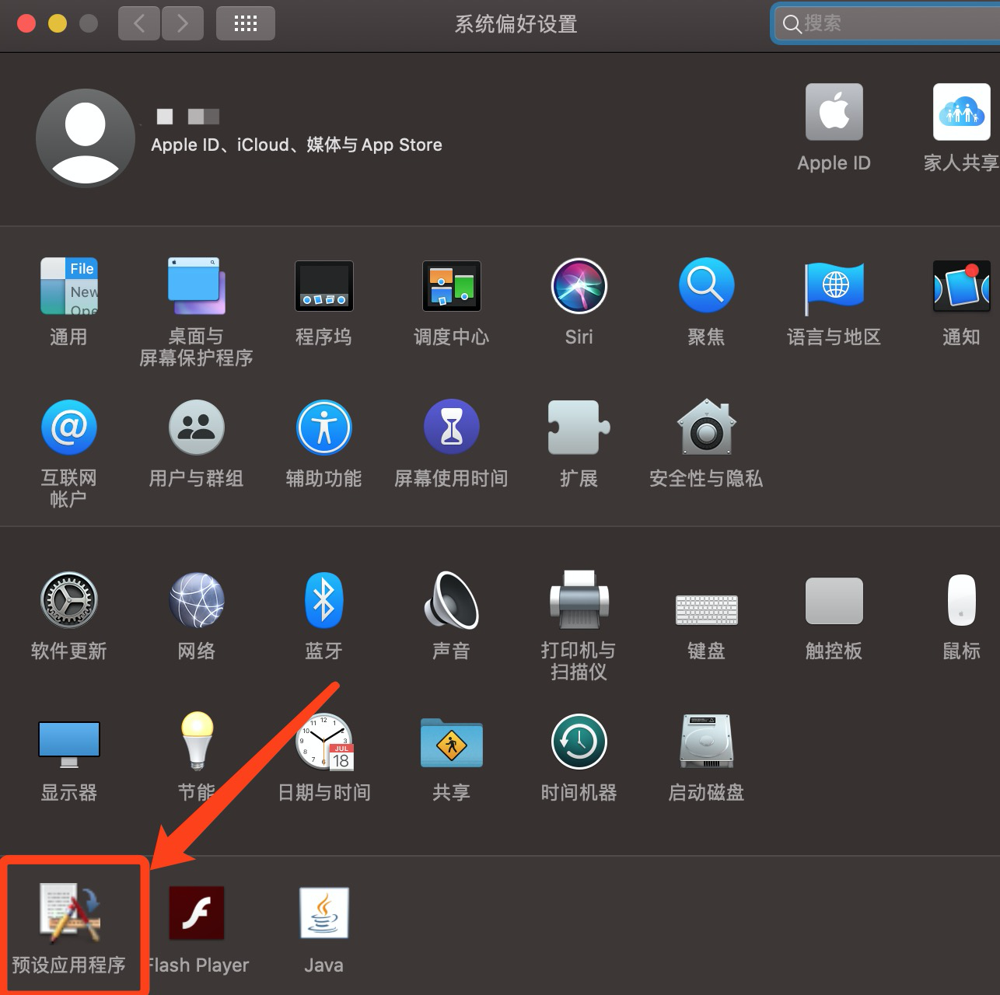
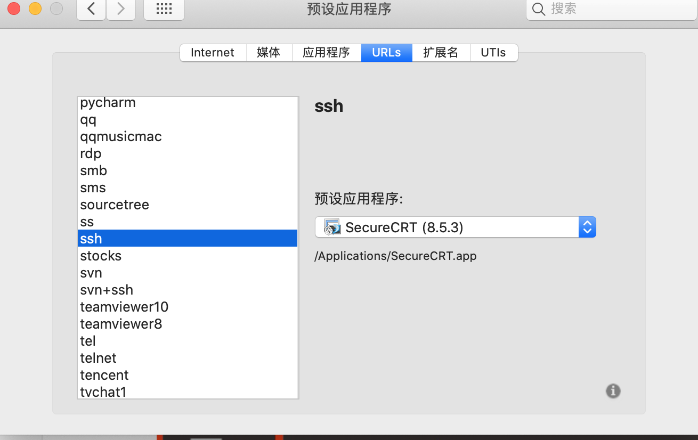
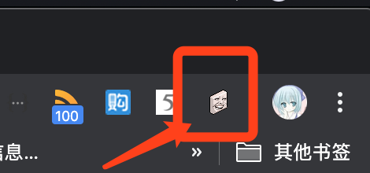
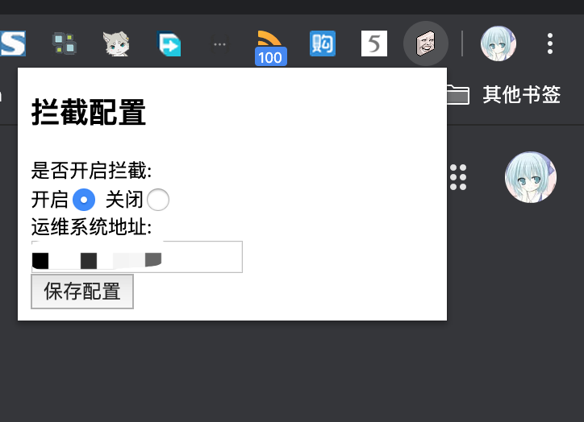
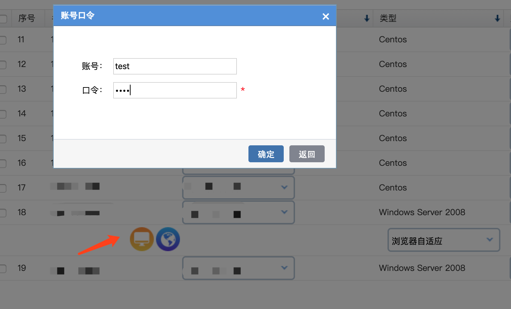

# 使用说明
## 声明
本插件仅为个人学习测试使用，请在下载后24小时内删除，不得用于商业用途，否则后果自负
## 前言
## 准备条件
- 合法的运维帐号及目标运维目标Win服务器
- 安装Microsoft Remote Desktop For Mac(支持Windows服务器)
- 安装SecureCRT（支撑Unix服务器）
- RCDefaultApp 2.1（修改Mac下默认程序）

其中关于Microsoft Remote Desktop版本推荐版本10及以上，安装方式分为**AppStore（推荐）**及自行安装。其中AppStore安装方式需要更改您的AppId归属地区及国家，亲测侧换至US可以正常下载。

- AppId切换地区及国区的方法请自行百度或者Google
- Microsoft Remote Desktop 10（不保证安全） https://www.techspot.com/downloads/4698-microsoft-remote-desktop-for-mac.html 
- SecureCRT（不保证安全） https://www.zhinin.com/securecrt-mac.html
- RCDefaultApp 2.1（不保证安全）   http://www.rubicode.com/Software/Bundles.html#RCDefaultApp

## 环境配置
安装SecureCRT后，安装RCDefaultApp后变更ssh协议默认程序

URLS->ssh->修改为SecureCRT 打开即可

## 关于本插件安装方法(2020年03月02更新Tampermonkey插件方式)
### 使用chrome插件方式（方式一）
最新下载地址：https://github.com/acshmily/f-ck-sangfor-hac/releases

安装方法：https://www.jianshu.com/p/bb51dc91b93a
### 使用Tampermonkey方式（方式二，推荐不限定浏览器）
在您使用的浏览器安装Tampermonkey插件（安装方法请自行搜索），添加拦截脚本即可，目前同步脚本已经发布至greasyfork

脚本加载地址：https://greasyfork.org/zh-CN/scripts/397173-f-ck-sangfor-hac
## 使用方法

在Chrome右上角找到本插件：

点击后会弹出一个窗口进行相关配置，如需要使用请选择**开启**，运维系统地址请填写运维系统所在**IP**，例如 192.168.199.99，配置后点击保存即可生效。

在运维系统选择Win中间机，选择**RDP**协议，填写合法的帐号及密码点击确认即可

